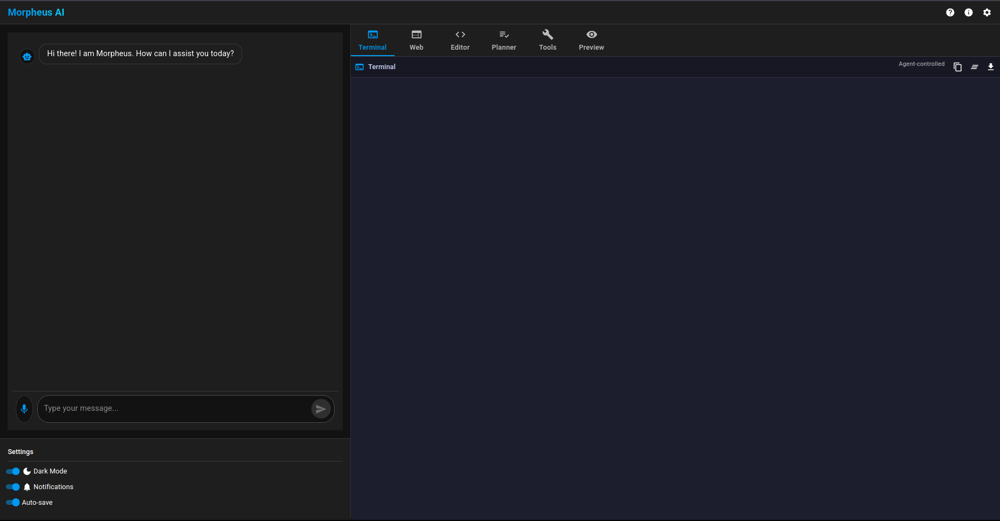

# Morpheus AI

A modern, intuitive AI assistant interface that empowers you with multiple AI-controlled tools in a unified workspace.



## Overview

Morpheus AI is a React-based application that provides a sleek interface for interacting with an AI assistant. It features a unique design where the AI agent controls various tools on your behalf, including a terminal, web browser, code editor, task planner, tool selector, and preview window.

**Note: The frontend is currently functional, while the backend integration is in progress.**

## Features

- **User Query Window**: Communicate with the AI assistant through an intuitive chat interface
- **Agent-controlled Tools**:
  - **Terminal**: Execute commands in a simulated terminal environment
  - **Web Browser**: Browse the web through the AI assistant
  - **Code Editor**: View and edit code with the assistant
  - **Planner**: Organize tasks and track progress
  - **Tools**: Access specialized AI tools for various tasks
  - **Preview**: Preview generated content and results
- **User Control Toggle**: Take manual control of any tool when needed with a simple toggle switch
- **Clean, Modern UI**: Built with Material-UI for a responsive and aesthetically pleasing experience
- **Dark Mode Support**: Toggle between light and dark themes based on your preference
- **Tabbed Interface**: Switch between different tools with a convenient tabbed layout

## Getting Started

### Prerequisites

- Node.js (v14 or higher)
- npm or yarn

### Installation

1. Clone the repository:
   ```
   git clone https://github.com/yourusername/morpheus.git
   cd morpheus
   ```

2. Install dependencies:
   ```
   cd frontend
   npm install
   ```

3. Start the development server:
   ```
   npm start
   ```

4. Open your browser and navigate to `http://localhost:3000`

### Development Environment

For a better development experience:

- Use a modern IDE like VS Code with React extensions
- Install React Developer Tools browser extension

## Sharing for Development

To share your local development server with others:

1. Install ngrok:
   ```
   npm install -g ngrok
   ```

2. Create a `.env` file in the frontend directory with:
   ```
   DANGEROUSLY_DISABLE_HOST_CHECK=true
   ```

3. Start the React app:
   ```
   npm start
   ```

4. In another terminal window, run:
   ```
   ngrok http 3000
   ```

5. Share the ngrok URL with others

## User Control Mode

While Morpheus AI is primarily designed to have the AI agent control the tools, you can easily take manual control when needed:

1. In the settings panel on the left side, toggle the "User Control" switch
2. This enables direct interaction with all tool windows
3. You can return control to the AI agent at any time by toggling the switch off

This feature is particularly useful when you want to:
- Manually explore options that the AI hasn't suggested
- Make quick edits or modifications yourself
- Take over complex tasks that require human judgment

## Project Structure

```
frontend/
├── public/
├── src/
│   ├── components/       # Reusable components
│   ├── windows/          # Tool window components
│   ├── styles/           # Global styling
│   ├── App.tsx           # Main app component
│   └── index.tsx         # Entry point
├── package.json
└── README.md
```

## Technologies Used

- React
- TypeScript
- Material-UI
- React Router

## Current Status

- ✅ Frontend UI implementation
- ✅ Agent-controlled tool interfaces
- ✅ User control override functionality
- ✅ Responsive design
- ✅ Dark mode support
- ⏳ Backend API integration (in progress)
- ⏳ Real AI agent functionality (in progress)

## License

[MIT License](LICENSE)

## Acknowledgements

- [Material-UI](https://mui.com/)
- [React](https://reactjs.org/)
- [TypeScript](https://www.typescriptlang.org/) 
